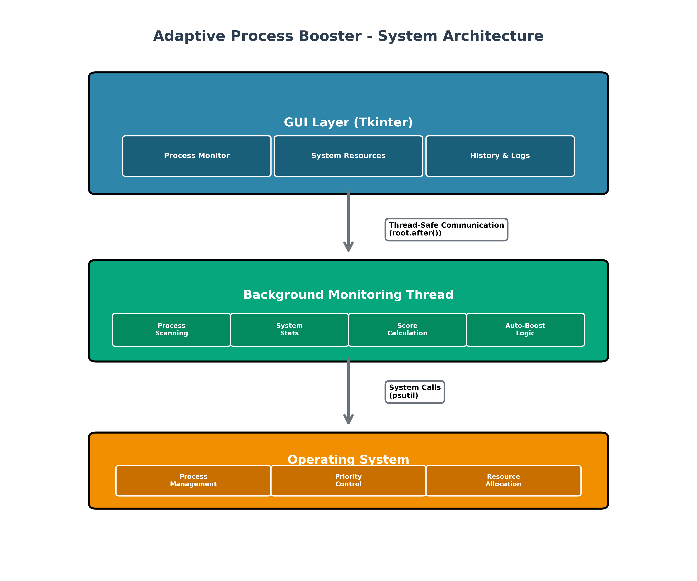

# Architecture Diagram Creation & Conversion Guide

## Overview

This guide explains how to create system architecture diagrams for the Adaptive Process Booster project and convert them to various formats.

---

## Method 1: Using Matplotlib (Recommended)

### Installation

```bash
pip install matplotlib
```

### Usage

```bash
python create_architecture_diagram.py
```

### What It Creates

1. **System_Architecture_Diagram.png** - Main system architecture
2. **Threading_Architecture_Diagram.png** - Threading model
3. **Data_Flow_Diagram.png** - Data flow visualization

### Features

- ✅ High resolution (300 DPI)
- ✅ Professional appearance
- ✅ Color-coded components
- ✅ Clear labels and arrows
- ✅ Multiple output formats

### Output Formats

The script supports:
- **PNG** (default) - Best for presentations
- **SVG** - Scalable vector graphics
- **PDF** - For documents

### Converting to Multiple Formats

```python
# In create_architecture_diagram.py, run:
convert_to_multiple_formats()
```

This creates all diagrams in PNG, SVG, and PDF formats.

---

## Method 2: Using Diagrams Library (Alternative)

### Installation

```bash
pip install diagrams
```

### Usage

```bash
python create_architecture_diagrams_advanced.py
```

### What It Creates

- **architecture_diagrams_lib.png** - Architecture using diagrams library
- **Process_Flowchart_Diagram.png** - Process flowchart

### Features

- ✅ Professional diagram library
- ✅ Pre-built components
- ✅ Easy to modify
- ✅ Clean output

---

## Converting Diagrams to Different Formats

### 1. PNG to JPG

**Using Python (PIL/Pillow):**
```python
from PIL import Image

img = Image.open('System_Architecture_Diagram.png')
img = img.convert('RGB')
img.save('System_Architecture_Diagram.jpg', 'JPEG', quality=95)
```

**Using Command Line (ImageMagick):**
```bash
magick convert System_Architecture_Diagram.png System_Architecture_Diagram.jpg
```

### 2. PNG to SVG

**Using Python (cairosvg):**
```bash
pip install cairosvg
```

```python
import cairosvg

cairosvg.png2svg(url='System_Architecture_Diagram.png', 
                  write_to='System_Architecture_Diagram.svg')
```

**Or use the built-in SVG export:**
```python
create_architecture_diagram('svg')
```

### 3. PNG to PDF

**Using Python:**
```python
from PIL import Image

img = Image.open('System_Architecture_Diagram.png')
img.save('System_Architecture_Diagram.pdf', 'PDF', resolution=300.0)
```

**Or use the built-in PDF export:**
```python
create_architecture_diagram('pdf')
```

### 4. PNG to WebP

**Using Python (PIL):**
```python
from PIL import Image

img = Image.open('System_Architecture_Diagram.png')
img.save('System_Architecture_Diagram.webp', 'WEBP', quality=90)
```

### 5. PNG to Base64 (for web/HTML)

```python
import base64
from PIL import Image
import io

img = Image.open('System_Architecture_Diagram.png')
buffer = io.BytesIO()
img.save(buffer, format='PNG')
img_str = base64.b64encode(buffer.getvalue()).decode()
print(f"data:image/png;base64,{img_str}")
```

---

## Complete Conversion Script

Here's a complete script to convert diagrams to all formats:

```python
#!/usr/bin/env python3
"""
Convert architecture diagrams to multiple formats
"""

from PIL import Image
import os

def convert_diagram(input_file, output_formats=['jpg', 'webp', 'pdf']):
    """Convert a diagram to multiple formats."""
    
    if not os.path.exists(input_file):
        print(f"❌ File not found: {input_file}")
        return
    
    base_name = os.path.splitext(input_file)[0]
    img = Image.open(input_file)
    
    # Convert to RGB if needed (for JPG)
    if img.mode in ('RGBA', 'LA', 'P'):
        rgb_img = Image.new('RGB', img.size, (255, 255, 255))
        if img.mode == 'P':
            img = img.convert('RGBA')
        rgb_img.paste(img, mask=img.split()[-1] if img.mode == 'RGBA' else None)
        img = rgb_img
    
    for fmt in output_formats:
        try:
            output_file = f"{base_name}.{fmt}"
            if fmt == 'pdf':
                img.save(output_file, 'PDF', resolution=300.0)
            elif fmt == 'webp':
                img.save(output_file, 'WEBP', quality=90)
            elif fmt == 'jpg':
                img.save(output_file, 'JPEG', quality=95)
            print(f"✅ Created: {output_file}")
        except Exception as e:
            print(f"⚠️  Error creating {fmt}: {e}")

# Convert all diagrams
diagrams = [
    'System_Architecture_Diagram.png',
    'Threading_Architecture_Diagram.png',
    'Data_Flow_Diagram.png'
]

for diagram in diagrams:
    if os.path.exists(diagram):
        print(f"\n📊 Converting {diagram}...")
        convert_diagram(diagram)
    else:
        print(f"⚠️  {diagram} not found. Run create_architecture_diagram.py first.")
```

---

## Using Diagrams in Presentations

### For PowerPoint

1. **Insert as Image:**
   - Insert → Pictures → This Device
   - Select the PNG file
   - Resize as needed

2. **Insert as Object:**
   - Insert → Object → Create from File
   - Select the PDF file
   - Better quality, scalable

### For Google Slides

1. Insert → Image → Upload from computer
2. Select PNG or JPG file
3. Resize and position

### For LaTeX Documents

```latex
\usepackage{graphicx}

\begin{figure}[h]
    \centering
    \includegraphics[width=\textwidth]{System_Architecture_Diagram.pdf}
    \caption{System Architecture}
    \label{fig:architecture}
\end{figure}
```

### For Markdown Documents

```markdown

```

### For HTML/Web

```html

```

---

## Customization

### Changing Colors

Edit the color definitions in `create_architecture_diagram.py`:

```python
# Define colors
gui_color = '#2E86AB'      # Blue - Change this
thread_color = '#06A77D'   # Green - Change this
os_color = '#F18F01'       # Orange - Change this
```

### Changing Font Sizes

```python
# Title font size
fontsize=20  # Change to desired size

# Component font size
fontsize=10  # Change to desired size
```

### Changing Diagram Size

```python
# Figure size (width, height in inches)
fig, ax = plt.subplots(1, 1, figsize=(14, 10))  # Change these values
```

### Adding More Components

```python
# Add a new box
new_box = FancyBboxPatch((x, y), width, height, 
                         boxstyle="round,pad=0.1", 
                         edgecolor='black', facecolor='#COLOR', 
                         linewidth=2, zorder=1)
ax.add_patch(new_box)
ax.text(x+width/2, y+height/2, 'Text', 
        ha='center', va='center', fontsize=12, color='white')
```

---

## Troubleshooting

### Issue: matplotlib not found

**Solution:**
```bash
pip install matplotlib
```

### Issue: Low resolution output

**Solution:**
Increase DPI:
```python
plt.savefig(filename, format='png', dpi=300, bbox_inches='tight')
# Change dpi=300 to dpi=600 for higher resolution
```

### Issue: Text cut off

**Solution:**
Adjust `bbox_inches`:
```python
plt.savefig(filename, format='png', dpi=300, bbox_inches='tight', pad_inches=0.2)
```

### Issue: Colors not showing

**Solution:**
Check if you're using a colorblind-friendly palette:
```python
# Use colorblind-friendly colors
colors = ['#2E86AB', '#06A77D', '#F18F01', '#9B59B6', '#E74C3C']
```

---

## Best Practices

1. **Use High Resolution:** Always use 300 DPI or higher for presentations
2. **Consistent Colors:** Use the same color scheme throughout
3. **Clear Labels:** Make sure all text is readable
4. **Proper Spacing:** Leave enough space between components
5. **Arrow Clarity:** Use arrows to show data flow clearly
6. **Legend:** Add a legend if using many colors
7. **Title:** Always include a clear title

---

## Quick Reference

### Create Diagrams
```bash
python create_architecture_diagram.py
```

### Convert to Multiple Formats
```python
convert_to_multiple_formats()
```

### Convert Single File
```python
convert_diagram('System_Architecture_Diagram.png', ['jpg', 'pdf', 'webp'])
```

### Output Formats Supported
- PNG (default, best quality)
- SVG (scalable vector)
- PDF (for documents)
- JPG (smaller file size)
- WebP (modern web format)

---

## Example Workflow

1. **Create diagrams:**
   ```bash
   python create_architecture_diagram.py
   ```

2. **Review output:**
   - Check PNG files
   - Verify all components are visible
   - Ensure text is readable

3. **Convert if needed:**
   ```python
   convert_diagram('System_Architecture_Diagram.png', ['pdf', 'jpg'])
   ```

4. **Use in presentation:**
   - Insert into PowerPoint
   - Add to document
   - Include in website

---

## Summary

- ✅ **Method 1 (Matplotlib)**: Best for custom diagrams, high quality
- ✅ **Method 2 (Diagrams Library)**: Best for quick professional diagrams
- ✅ **Multiple Formats**: PNG, SVG, PDF, JPG, WebP supported
- ✅ **Easy Conversion**: Simple scripts for format conversion
- ✅ **Customizable**: Colors, sizes, fonts all adjustable

For questions or issues, refer to the troubleshooting section or check the code comments in the Python scripts.


